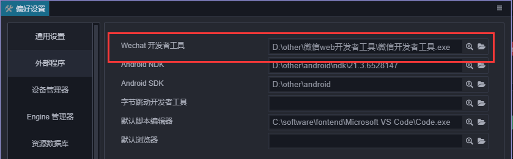
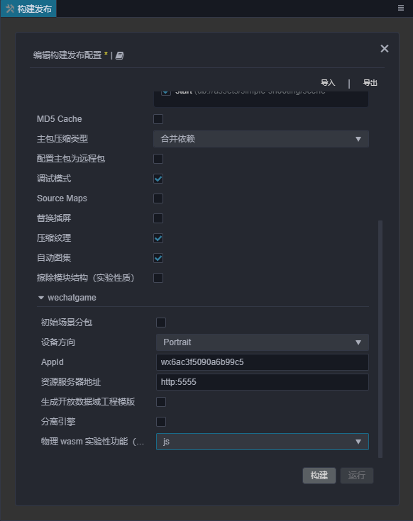
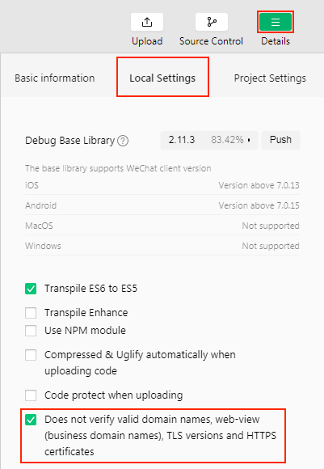

# 发布到微信小游戏

微信小游戏的运行环境是微信小程序环境的扩展，在小程序环境的基础上提供了 WebGL 接口的封装，使得渲染能力和性能有了大幅度提升。不过由于这些接口都是微信团队通过自研的原生实现封装的，所以并不可以等同为浏览器环境。

作为引擎方，为了尽可能简化开发者的工作量，我们为用户完成的主要工作包括：

- 引擎框架适配微信小游戏 API，纯游戏逻辑层面，用户不需要任何额外的修改
- Cocos Creator 编辑器提供了快捷的打包流程，直接发布为微信小游戏，并自动唤起小游戏的开发者工具
- 自动加载远程资源，缓存资源以及缓存资源版本控制

除此之外，小游戏的游戏提交，审核和发布流程和小程序是没有区别的，都需要遵守微信团队的要求和标准流程，具体信息可以参考文末的链接。

## 使用 Cocos Creator 发布微信小游戏

1. 在 [微信官方文档](https://mp.weixin.qq.com/debug/wxagame/dev/devtools/download.html) 下载微信开发者工具

2. 在编辑器菜单栏的 **Cocos Creator -> 偏好设置 -> [原生开发环境](../../editor/preferences/index.md#%E5%8E%9F%E7%94%9F%E5%BC%80%E5%8F%91%E7%8E%AF%E5%A2%83)** 中设置微信开发者工具路径

    

3. 登陆微信公众平台，找到 appid

    

4. 在 **构建发布** 面板的 **发布平台** 中选择 **微信小游戏**，填入小游戏 appid，然后点击 **构建**

    

5. 点击 **运行** 打开微信开发者工具

    

    **注意**：微信开发者工具，如果之前在点击上没运行过，会出现：`Please ensure that the IDE has been properly installed` 的报错。需要手动打开一次微信开发者工具，然后才能在 Cocos Creator 里直接点击 **运行** 调用。

6. 预览部署

    按照这样的流程，项目的 build 目录下就会生成一个微信小游戏的发布包 **wechatgame** 文件夹(具体构建任务名为准），其中已经包含了微信小游戏环境的配置文件：`game.json` 和 `project.config.json`

    

## 构建选项介绍

选项名 | 可选 | 默认值 | 说明
- | - | - | -
分包 | 可选 | true | 设是否开启分包功能
主包压缩类型 | 必填 | 合并依赖 JSON | 设置主包的压缩类型，具体内容可参考文档 [Asset Bundle — 压缩类型](../asset-manager/bundle.md)。
初始场景分包 | 选填 | false | 勾选后，首场景及其相关的依赖资源会被构建到发布包目录 assets 下的内置 Asset Bundle — [start-scene](../asset-manager/bundle.md) 中，提高初始场景的资源加载速度。具体内容可参考文档下方的 [初始场景的资源加载](#初始场景的资源加载)。
appid | 必填 | 'wx6ac3f5090a6b99c5' | 微信小游戏 appid，填写后将会写入在 `project.config.json` 内。
远程服务器地址 | 选填 | 空 | 远程服务器地址，之后将会从该地址获取资源
开放数据域代码目录 | 选填 | 空 | 如果存在开放数据域的话，通过这个字段来指定开放数据域文件夹在构建目录中的相对路径，这样在构建过程中就不会覆盖或修改该目录
设备方向 | 必填 | landscape | 设备方向，填写后将会写入在 `game.json` 内。

## 微信小游戏的资源管理

在微信小游戏环境中，资源管理是最特殊的部分，它和浏览器的不同包括以下几点：

1. 小游戏的主包体积不能超过 4MB，包含所有代码和资源，额外的资源必须通过网络请求下载。
2. 对于小游戏包内资源，小游戏环境内并不是按需加载的，而是一次性加载所有包内资源，然后再启动页面。
3. 不可以从远程服务器下载脚本文件。

这里引出了两个关键的问题，一个是远程资源的下载、缓存及版本管理，另一个是首场景的加载速度。下面我们来看一下这部分的逻辑：

### 远程资源的下载、缓存及版本管理

项目内所有的资源都是以 [Asset Bundle](../../asset-manager/bundle.md) 为单元进行管理的。对于远程资源的下载、缓存和版本管理，Creator 已经帮开发者做好了。我们来看一下在小游戏环境中，引擎下载资源的逻辑：

1. 判断资源是否在小游戏包中
2. 如果不在则检查资源是否在本地缓存中
3. 如果不在则检查资源是否在临时文件中
4. 如果找不到就从远程服务器下载资源
5. 资源下载到临时文件后直接使用
6. 后台缓慢地将资源从临时文件保存到本地缓存中，以便再次访问时使用
7. 缓存空间有大小限制，如果超出限制则资源会保存失败，此时会使用 LRU 算法删除比较久远的资源

一旦缓存空间占满，所有需要下载的资源都无法保存，只能使用下载保存在临时文件中的资源。而当退出小游戏时，所有的临时文件都会被清理，再次运行小游戏时，这些资源又会被再次下载，如此循环往复。 
另外，缓存空间超出限制导致文件保存失败的问题不会在 **微信开发者工具** 上出现，因为微信开发者工具没有限制缓存大小，所以测试缓存时需要在真实的微信环境中进行测试。

当开启引擎的 md5Cache 功能后，文件的 url 会随着文件内容的改变而改变，这样当游戏发布新版本后，旧版本的资源在缓存中就自然失效了，只能从服务器请求新的资源，也就达到了版本控制的效果。

#### 上传资源到远程服务器

如果你需要将资源上传到远程服务器，请将资源所在的 Asset Bundle 配置为远程包。接下来，我们来看一下具体的操作步骤：

1. 合理分配资源，将需要模块化管理的资源文件夹配置为 Asset Bundle，并勾选 **配置为远程包**，具体可参考文档 [配置 Asset Bundle](../scripting/asset-bundle.md)。

    

2. 如果主包需要配置为远程包，请在 **构建发布** 面板中勾选 **配置主包为远程包**。
3. 勾选 **MD5 Cache**。
4. 设置 **资源服务器地址**，然后点击 **构建**。

    

5. 构建完成后将发布包目录下的 remote 文件夹完整地上传到上一步填写的服务器上。
6. 删除本地发布包目录下的 remote 文件夹。
7. 在测试阶段，开发者可能无法将项目部署到正式服务器，那就需要在本地服务器测试，请在微信开发者工具的菜单栏中打开 **工具 -> 详情 -> 本地设置** 页面，勾选 **不检验安全域名、TLS 版本以及 HTTPS 证书** 选项。

    

#### 清除缓存资源

如果缓存资源超出限制，开发者需要手动清除资源，可以使用 `cc.assetManager.cacheManager` 提供的方法 `clearCache()`、`clearLRU()` 和 `removeCache(cacheId: string)` 来清除缓存。

- `clearCache()` —— 清除缓存目录下的所有缓存资源，请慎重使用。
- `clearLRU()` —— 清除缓存目录下目前应用中最近最少使用的缓存。
- `removeCache(cacheId: string)` —— 精确移除某个资源在缓存中的记录。

当开发者升级引擎版本后，留在本地的缓存资源还是之前旧版本引擎对应的资源，并不会自动清空。这可能会导致资源加载出错或渲染错误等问题。解决方案有以下两种：

- 构建时在 **构建发布** 面板勾选 **MD5 Cache** 选项，这将确保使用最新版本的资源。
- 手动清空之前缓存的资源。
  - 在 **真机** 上通过 `cc.assetManager.cacheManager.clearCache()` 清空缓存。
  - 在 **微信开发者工具** 中点击菜单栏的 **工具 -> 清除缓存 -> 全部清除** 来清空缓存。

### 初始场景的加载速度

当主包资源放到远程服务器上时，如果要提高初始场景的加载速度，可以在构建时勾选 **构建发布** 面板中的 **初始场景分包** 选项。 
构建完成后，初始场景及其相关的依赖资源会被构建到发布包目录下的 `assets/start-scene` bundle 中。该 bundle 不会放在远程服务器上，而是放在本地，引擎在启动阶段时就会自动从本地包内加载这个 bundle，从而加快初始场景的加载速度。

## 微信小游戏分包加载

请参考 [分包加载](../../asset/subpackage.md)。

## 平台 SDK 接入

除了纯游戏内容以外，其实微信小游戏环境还提供了非常强大的原生 SDK 接口，其中最重要的就是用户、社交、支付等，这些接口都是仅存在于微信小游戏环境中的，等同于其他平台的第三方 SDK 接口。这类 SDK 接口的移植工作在现阶段还是需要开发者自己处理。下面列举一些微信小游戏所提供的强大 SDK 能力：

1. 用户接口：登陆，授权，用户信息等
2. 微信支付
3. 转发以及获得转发信息
4. 文件上传下载
5. 媒体：图片、录音、相机等
6. 其他：位置、设备信息、扫码、NFC、等等

## 微信小游戏已知问题

微信小游戏不支持 WebView。

## 参考链接

- [微信小游戏开发文档](https://developers.weixin.qq.com/minigame/dev/guide/)
- [微信公众平台](https://mp.weixin.qq.com/)
- [小游戏 API 文档](https://developers.weixin.qq.com/minigame/dev/api/)
- [微信开发者工具下载](https://developers.weixin.qq.com/miniprogram/dev/devtools/download.html)
- [微信开发者工具文档](https://developers.weixin.qq.com/miniprogram/dev/devtools/devtools.html)
- [微信缓存空间溢出测试案例](https://github.com/cocos-creator/WeChatMiniGameTest)
